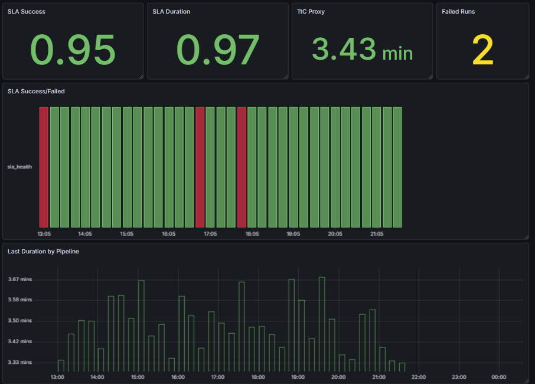
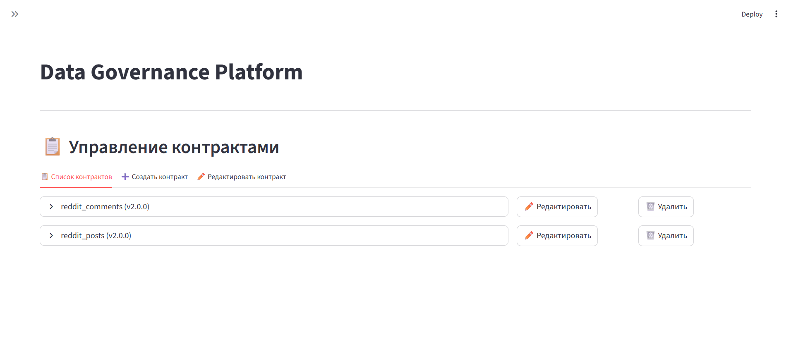

# Data Governance
Проект представляет систему Data Governance, обеспечивающую автоматическую оркестрацию, контроль качества и публикацию метаданных на основе декларативных дата-контрактов

### Что внутри

- **Контракты**: `contracts/*.yaml` (можно управлять из UI).
- **Backend**: FastAPI (API + swagger).
- **Frontend**: Streamlit (UI для контрактов и запусков).
- **Iceberg REST**: каталог таблиц/метаданных.
- **DataHub**: data catalog + lineage (через OpenLineage).
- **Airflow** : генерация/запуск DAG’ов.
- **Monitoring** : Prometheus + Grafana + exporter метрик пайплайнов.

### Скриншоты

**Grafana dashboard (пример мониторинга):**



**UI (управление контрактами):**



### Быстрый старт

**Требования:**
- Docker (и `docker compose`)
- Python 3.x

**1) Установка зависимостей**

```bash
python -m venv venv
source venv/bin/activate
pip install -r requirements.txt
```

**2) (Опционально) генерация тестовых данных для ETL**

```bash
python scripts/json_dump_gen.py
```

Создаёт `data/sample/posts.json` и `data/sample/comments.json`

### 3. Запуск всех сервисов

```bash
bash scripts/start_all.sh
```

Запускает: Iceberg REST, DataHub, Airflow, Backend, Frontend.

**Остановка:**

```bash
bash scripts/stop_all.sh
```

### URLs (после запуска)

| Сервис | URL |
|--------|-----|
| **Frontend (Streamlit)** | http://localhost:8501 |
| **Backend API** | http://localhost:8000 |
| **Backend Docs** | http://localhost:8000/docs |
| **DataHub UI** | http://localhost:9002 (datahub/datahub) |
| **Iceberg REST** | http://localhost:8181 |
| **Prometheus** | http://localhost:9090 |
| **Grafana** | http://localhost:3000 (admin/admin) |
| **Metrics exporter** | http://localhost:9108/metrics |
| **Airflow UI** | http://localhost:8070 |
| **StarRocks** | SQL 127.0.0.1:9030 (root), HTTP http://127.0.0.1:8030 |


